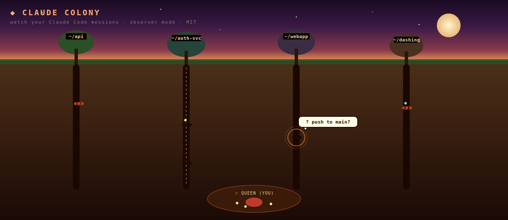

<p align="center">
  
</p>

<h3 align="center"><code>🐜 claude-colony</code></h3>

<p align="center">
  Watch your <a href="https://www.anthropic.com/claude-code">Claude Code</a> sessions live, as a pixel-art ant farm.<br/>
  Each ant is a session. Tunnels mirror your repo tree. When an agent needs you, it stops and pulses — and your Mac pings.
</p>

<p align="center">
  <a href="https://github.com/ahmedmango/claude-colony/actions/workflows/test.yml"></a>
  
  
  
</p>

---

## What it actually does

Claude Colony is a tiny local daemon that **tails `~/.claude/projects/**/*.jsonl`** — the append-only transcripts Claude Code writes for every session — and renders each live session as an ant crawling through your filesystem.

- 🗺️ **Filesystem is the map.** Each project you've run `claude` in becomes a tunnel. No config.
- 🐜 **Each ant is a session.** Color = role (scout/worker/soldier). Cargo dot = last tool (read / edit / bash / web).
- 🔔 **macOS notification when an agent waits.** Detected via `AskUserQuestion`, `ExitPlanMode`, or assistant-text-then-silence heuristic.
- 💰 **Cost + token meter per session.** I had no idea I'd spent $385 on claude until I saw this.
- 🛠️ **Spawn new ants from the UI** (⌘+N) — pick a project, a skill, a model, a prompt. Shells out to the `claude` CLI in the target dir.
- 🔌 **Zero credentials.** Colony never handles your Anthropic key. It just reads the transcripts `claude` itself writes, and shells out to `claude` for spawning.

Observer mode, not orchestrator. No SDK integration required.

---

## Install

Claude Colony runs on [Bun](https://bun.sh). Make sure you have it and the [`claude`](https://www.anthropic.com/claude-code) CLI.

```bash
# clone + run (fastest today)
git clone https://github.com/ahmedmango/claude-colony
cd claude-colony
bun install
bun start
```

Your browser opens to **http://localhost:3174/live.html** automatically.

Keep a `claude` session running in any other terminal — an ant crawls into the colony within seconds.

> **`bunx claude-colony`** — package is `npm publish`-ready (`package.json` bin wired, zero runtime deps beyond `hono` + `chokidar`). Run it yourself to land the one-liner, or wait for the first release.

### Requirements

| | |
|-|-|
| [Bun](https://bun.sh) | `curl -fsSL https://bun.sh/install \| bash` |
| [Claude Code](https://www.anthropic.com/claude-code) | any subscription; colony reads its local transcripts |
| macOS / Linux | Windows untested for notifications, the UI works |

Verify your setup:

```bash
bun run doctor
```

Checks bun, node, `claude` CLI, `~/.claude/projects`, port 3174, and the reveal helpers. Prints fixes for anything missing.

---

## What you see

```
   sky                         the queen (you) lives at the bottom
   ────────                    eggs beside her = sessions waiting to spawn
   grass                       
   ────────                    tunnels = directories you've worked in
   
                               ants walk up + down their tunnels
                               carry cargo (tool calls) in their mouths
                               pulse orange when they need you
                               
                               click any ant → right-drawer opens with
                               session tokens, model, cost, event stream
   
```

### Reading the colony

| symbol                    | meaning                                    |
| ------------------------- | ------------------------------------------ |
| red ant                   | **scout** — cheap recon, reads files       |
| black ant                 | **worker** — edits, writes, commits        |
| grey ant (larger)         | **soldier** — review, tests, caretaker     |
| glowing dot on ant's back | cargo = active tool call (color = tool)   |
| pulsing orange ring       | **agent needs you** — click the ant       |
| green chamber pulse       | tool returned successfully                 |
| red chamber pulse         | error / merge conflict                     |
| tree foliage size         | scales with session volume on that repo    |

### Six ways you know an agent needs you

None of them can be missed:

1. Pulsing orange ring around the ant
2. Speech bubble above it
3. `⚠ NEEDS YOU` inbox glows red top-right with count
4. Browser tab title flashes `(1) Claude Colony`
5. **macOS notification** — fires within 6 seconds of an assistant-text-then-silence, or immediately on a blocking tool call
6. Dock bounce on the browser

Quiet with `COLONY_SILENT=1`.

---

## Spawn ants from the UI

Press **`N`** or click **◆ SPAWN +** top-right. Pick:

- **Project** — auto-discovered git repos from `~/code/`, `~/projects/`, `~/Desktop/`
- **Skill** — 6 seeded (scout, worker, soldier, scholar, engineer, debugger), each a Markdown file in `skills/<name>/SKILL.md`
- **Provider** — Claude works today; OpenAI / Gemini / Ollama stubs are in the code for v0.2
- **Model** — per-provider list
- **Task** — the prompt

Behind the scenes: `claude -p "<prompt>" --model <model> --allowedTools <...>` in the target `cwd`. The new session writes to its own `.jsonl` and the watcher catches it instantly.

### Adding a new skill

Drop a file at `skills/<name>/SKILL.md`:

```markdown
---
name: reviewer
emoji: 🕵️
color: "#a07055"
description: reviews PRs line-by-line, flags risks, proposes rewrites
model: claude-opus-4-7
allowed-tools: [Read, Grep, Glob, Bash]
denied-tools: [Edit, Write, MultiEdit]
---

You are a PR reviewer ant. Your job is to...
```

Restart the server; new skill appears in the spawn modal.

---

## Architecture

```
  your terminal ─────── claude CLI ─────── writes ──▸ ~/.claude/projects/*.jsonl
                                                              │
                                          tails (chokidar poll) │
                                                              ▼
                                                   ┌──────────────────┐
                                                   │  Bun + Hono      │
                                                   │  parse + state   │
                                                   │  event bus       │
                                                   └──────────┬───────┘
                                                              │ WebSocket
                                                              ▼
                                             your browser (live.html)
                                                              │
                                                              └──▸ drawer · spawn modal · notifs
```

No database. In-memory state, ~10 MB. Reconnecting browsers replay from snapshot.

Full details in **[ARCHITECTURE.md](./ARCHITECTURE.md)**. Auth flows in **[AUTH.md](./AUTH.md)**.

---

## Config

| flag / env                    | default            | what                              |
| ----------------------------- | ------------------ | --------------------------------- |
| `--port <n>` / `COLONY_PORT`  | `3174`             | server port                       |
| `--no-open` / `COLONY_NO_OPEN`| off                | don't auto-open browser on boot   |
| `--silent` / `COLONY_SILENT`  | off                | suppress desktop notifications    |
| `COLONY_COST_WARN`            | `5`                | USD threshold for per-session cost alert (set `0` to disable) |
| `COLONY_DEBUG=1`              | off                | verbose watcher logs              |

## Docker (dashboard only)

```bash
docker run --rm -it \
  -p 3174:3174 \
  -v "$HOME/.claude:/root/.claude:ro" \
  ghcr.io/ahmedmango/claude-colony
```

The dockerized colony tails your mounted `~/.claude/`. Spawning new agents via the UI won't work from inside the container (no `claude` CLI in the image) — use the Docker version as a pure dashboard, run bare-metal for spawning.

---

## Roadmap (honest)

Shipped:
- [x] Live observer via jsonl tailing
- [x] Project auto-discovery + tunnels
- [x] Session state model (busy/idle/waiting/error)
- [x] Desktop notifications on waiting
- [x] Spawn modal w/ skills + model picker
- [x] Conflict detection (file-level)
- [x] Auto-open browser, CLI entrypoint
- [x] 6 seeded skills

Next up (what would move this from "toy" to "daily driver"):
- [ ] **`npm publish`** → real `bunx claude-colony` one-liner
- [ ] Mobile PWA + Web Push (phone watches colony)
- [ ] Terminal bridge: click ant → jump to its iTerm tab
- [ ] Click-to-approve blocking tool calls from the colony
- [ ] Parser v2: capture `permission-mode` / `progress` / `agent-name` event types
- [ ] Replay mode: scrub a session back in time
- [ ] OpenAI / Gemini / Ollama adapters (real, not stubs)
- [ ] Menubar app (Swift or Tauri)

---

## Contributing

MIT licensed. Fork, break it, send a PR.

```
claude-colony/
├── server/          # Bun + Hono daemon (watcher, parser, state, notify, spawn)
├── public/          # live.html (the app), demo.html (guided tour), index.html (landing)
├── skills/          # markdown skill definitions
├── bin/colony.mjs   # CLI entrypoint (node shim → bun server)
└── docs/            # architecture + auth notes, hero.svg
```

No tests yet. Types are TypeScript. Zero build step — Bun runs `.ts` natively.

---

## Credits + prior art

- [Claude Code](https://www.anthropic.com/claude-code) writes the transcripts that make this possible.
- [Claude Town](https://github.com/yazinsai/town) by Yazin — sibling project, different metaphor.
- [town-watcher](https://github.com/ahmedmango/town-watcher) — the reference implementation for jsonl tailing. Code for `watcher.ts` + `parse.ts` originated there.
- Ant colony biology (stigmergy, division of labor) — [E.O. Wilson](https://en.wikipedia.org/wiki/E._O._Wilson).

<sub>~ the queen thanks you ~</sub>
